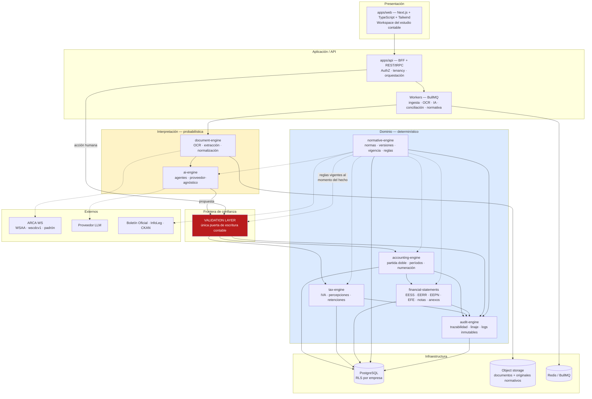
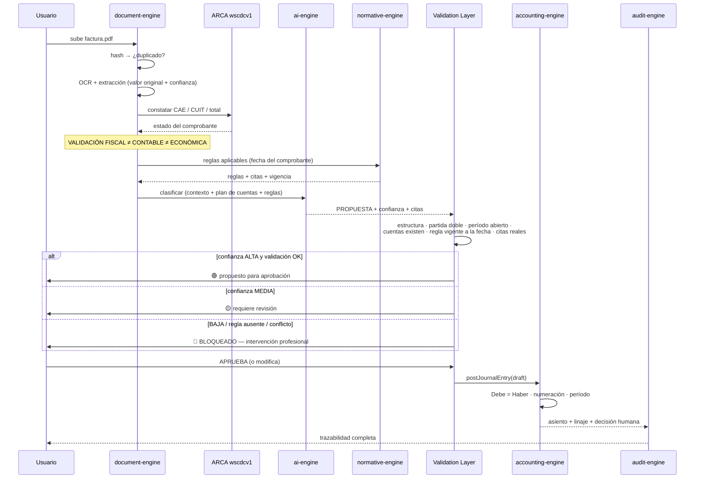

# ARCHITECTURE.md — Mapa de Arquitectura

> Entregables A y B del §51. Este documento define **cómo se separan las responsabilidades** para
> que la propiedad central del producto —*todo número tiene origen demostrable*— sea una
> consecuencia estructural y no una promesa.

## 1. Principio rector

```
PRECISIÓN > AUTOMATIZACIÓN
```

Tres invariantes que la arquitectura hace **imposibles de violar**, no meramente desaconsejadas:

| # | Invariante | Dónde se garantiza |
|---|-----------|--------------------|
| I-1 | La IA **nunca** escribe en las tablas contables | La IA solo produce filas en `ai_predictions`. No existe ruta de código entre el `ai-engine` y el motor contable |
| I-2 | Ningún asiento existe con `Debe ≠ Haber` | Constraint diferido en base + verificación en el servicio de posteo. Doble candado |
| I-3 | Ninguna cifra de estado contable existe sin cadena hasta un documento | `financial_statement_lines` guarda el `lineage_id` que resuelve la cadena completa |

**Corolario de diseño:** si mañana se apaga por completo el proveedor de IA, el sistema sigue
siendo un software contable funcional. La IA es una *capa de aceleración*, no un componente del
camino crítico de la verdad contable.

---

## 2. Vista de capas



**La línea roja es la tesis del producto.** Todo lo amarillo (probabilístico) solo puede afectar
lo azul (determinístico) atravesando la `Validation Layer`.

---

## 3. Mapa de módulos

### 3.1 `packages/normative-engine` — el módulo del que dependen todos

Responsabilidad: responder **una** pregunta, bien.

> *"Dado un hecho ocurrido el `D`, para un ente de tipo `T`, en jurisdicción `J`, bajo organismo
> de control `O`, con opción normativa `P` ejercida — ¿qué reglas eran aplicables y de qué texto
> exacto surgen?"*

Interfaz conceptual:

```ts
resolveRules(input: {
  factDate: Date;          // fecha del hecho económico, NO hoy
  periodId: PeriodId;      // período contable de imputación
  entityType: EntityType;
  jurisdiction: Jurisdiction;
  regulator: Regulator | null;
  framework: ReportingFramework;   // RT-FACPCE | NIIF | NIIF-PYMES
  domain: 'accounting' | 'tax' | 'disclosure';
  topic: string;
}): RuleResolution
// RuleResolution = { rules: Rule[], citations: Citation[], conflicts: Conflict[], gaps: Gap[] }
```

Reglas duras del módulo:
- **No conoce el reloj del sistema para decidir aplicabilidad.** Recibe `factDate`.
- Si dos reglas de igual prioridad compiten → `CONFLICTO NORMATIVO — REQUIERE REVISIÓN`. No desempata sola.
- Si no hay regla → `FUENTE NO ENCONTRADA`. No infiere.
- Toda `Rule` devuelta arrastra su `Citation` (organismo, norma, artículo, versión, vigencia, URL, hash del documento).
- Es **independiente del motor de IA** (§5 del pliego): no importa nada de `ai-engine`.

Ver `NORMATIVE_ENGINE.md`.

### 3.2 `packages/accounting-engine`

Motor determinístico de partida doble. No sabe qué es una factura ni qué es el IVA: recibe
`JournalEntryDraft` ya resuelto y decide si puede existir.

Responsabilidades: partida doble, balanceo, numeración correlativa por libro y período, apertura
y cierre, reapertura controlada, anulación **por contraasiento** (nunca `DELETE`), moneda y
conversión, centros de costo, bloqueo de períodos. Ver `ACCOUNTING_ENGINE.md`.

### 3.3 `packages/tax-engine`

Liquidación de IVA compras/ventas, notas de crédito y débito, percepciones y retenciones,
prorrateo, saldos técnicos y de libre disponibilidad, base para el Libro de IVA Digital.
Toda alícuota y todo régimen provienen de `normative-engine` con vigencia temporal — **ninguna
alícuota se escribe en el código**.

### 3.4 `packages/document-engine`

Pipeline de ingesta (§9): recepción → OCR → extracción → normalización → validación estructural →
clasificación de tipo → detección de duplicados → validación fiscal contra ARCA → propuesta.

Guarda por cada campo: **valor original, valor interpretado, confianza, método de extracción**
(§10). Los tres primeros son columnas distintas, nunca se pisan.

### 3.5 `packages/ai-engine`

Agentes (§29), todos detrás de una interfaz `LLMProvider` para cumplir la exigencia de ser
agnósticos del proveedor. Ningún agente tiene credenciales de escritura en base. Ver
`AI_ARCHITECTURE.md`.

### 3.6 `packages/financial-statements`

Armado de EESS/EERR/EEPN/EFE, notas y anexos **según el marco resuelto por `normative-engine`**.
No existe una plantilla universal hardcodeada (§19): existe un `StatementTemplate` versionado y
seleccionado por `(framework, entityType, regulator, period)`.

### 3.7 `packages/audit-engine`

Log inmutable append-only, encadenado por hash, y el **servicio de linaje** que resuelve la
navegación bidireccional del §24 en ambos sentidos.

### 3.8 `packages/shared`

Tipos, `Money` (entero en centavos + moneda; **prohibido `float`**), fechas, errores tipados,
Result/Either, utilidades de CUIT y validaciones argentinas.

---

## 4. Flujo principal — de un PDF a un estado contable



**Nótese:** la aprobación humana ocurre **antes** del posteo, y la propuesta de la IA nunca toca
`journal_entries`. Incluso en modo "alta confianza" lo que se genera es una propuesta pre-aprobada,
con usuario responsable registrado.

---

## 5. Trazabilidad bidireccional (§24) — cómo se implementa

No se resuelve con joins ad hoc. Se materializa un grafo de linaje:

```
document → document_extraction → invoice → invoice_item
        → journal_entry → journal_entry_line → account
        → ledger_movement → financial_statement_line → note_figure
                                   ↕
                        rule_application → norm_version → norm_document(hash)
```

`lineage_edges (from_type, from_id, to_type, to_id, relation, created_at)` — tabla append-only.
Cada cifra expuesta en la UI lleva su `lineage_id`; el botón *"¿de dónde salió este importe?"*
hace un recorrido del grafo en ambas direcciones, sin lógica especial por tipo de reporte.

---

## 6. Multiempresa y aislamiento (§25)

```
Organization (estudio contable)
 └── Company (empresa cliente)   ← frontera dura de datos
      └── FiscalYear → Period
```

Tres capas de aislamiento, no una:

1. **PostgreSQL Row Level Security** por `company_id`, con `SET LOCAL app.company_id` por transacción.
2. Middleware de tenancy en la API: ninguna consulta se construye sin `companyId` explícito.
3. Prefijo por empresa en el object storage + política de bucket.

Motivo del triple candado: en un estudio contable, una filtración entre dos empresas clientes es
un incidente de secreto profesional, no un bug de permisos.

---

## 7. Stack propuesto y por qué

| Capa | Elección | Razón |
|------|----------|-------|
| Frontend | Next.js + TypeScript + Tailwind + Radix/shadcn | Componentes accesibles; densidad de datos tipo ERP, no chat |
| Backend | Node.js + TypeScript (Fastify o NestJS) | Un solo lenguaje con el front; tipos compartidos con el dominio |
| Dominio | Paquetes TS puros, sin dependencias de framework ni de red | Testeables de forma exhaustiva y aislada — condición para los *accounting tests* |
| Base | PostgreSQL 16+ | RLS, constraints diferidos, `numeric`, particionado, JSONB para extracciones |
| Esquema | **SQL-first** con runner propio; el cliente tipado se deriva de la base | Casi todo lo que sostiene el producto es inexpresable en un ORM. Ver ADR-008 |
| Monorepo | **npm workspaces** | Una dependencia de tooling menos. Ver ADR-009 |
| Colas | Redis + BullMQ | Ingesta y OCR son asíncronos por naturaleza |
| Storage | S3-compatible con **object lock / versionado** | Requisito de conservación e inmutabilidad de originales |
| OCR | Adaptador `OcrProvider` (Tesseract local / servicio cloud) | Los documentos son secreto profesional: debe existir opción on-prem |
| IA | Adaptador `LLMProvider` | Exigencia explícita §28: agnóstico del proveedor |

### Decisión sobre dinero

`numeric(18,2)` en base y entero en centavos + código de moneda en el dominio.
**Nunca `float`/`double`.** Redondeo explícito y documentado por operación, con el criterio como
parámetro normativo (no como constante en el código).

---

## 8. ADRs iniciales

| ADR | Decisión |
|-----|----------|
| ADR-001 | La IA no escribe en base. Solo emite propuestas hacia la `Validation Layer` |
| ADR-002 | La vigencia normativa se resuelve por `(norma, jurisdicción, fecha del hecho)`, nunca por "hoy" |
| ADR-003 | Los asientos no se borran ni se editan: se anulan por contraasiento |
| ADR-004 | No se hace scraping de portales con Clave Fiscal. Solo WS oficiales y archivos que aporte el usuario |
| ADR-005 | Ninguna alícuota, monto o plazo se escribe en el código: son parámetros normativos versionados |
| ADR-006 | Las estructuras de estados contables son plantillas versionadas seleccionadas por marco aplicable |
| ADR-007 | El aprendizaje por empresa afecta la confianza y las preferencias de clasificación, **jamás** una regla normativa (§14) |

Se documentan en `docs/architecture/adr/`.
