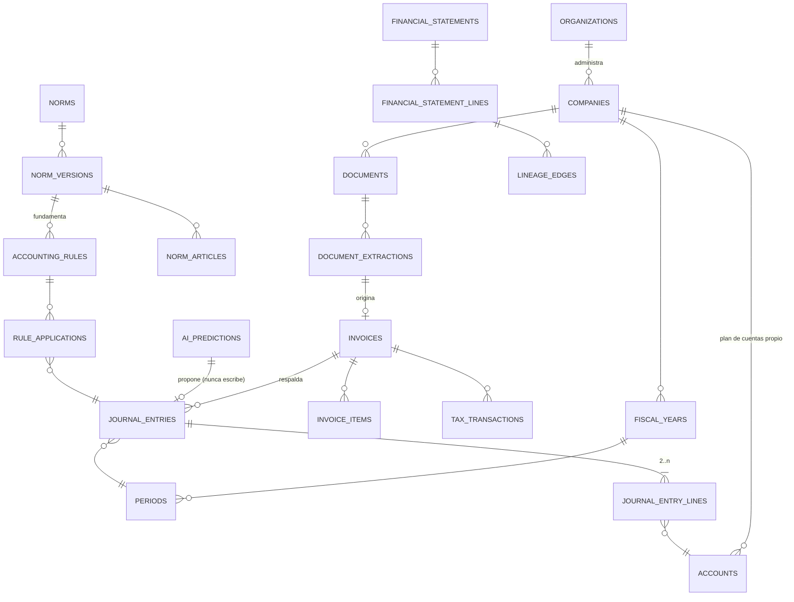

# DATABASE.md — Modelo de Datos

> Entregable C del §51. Modelo lógico. La implementación (Prisma + SQL) llega en FASE 1; el
> borrador de esquema está en `docs/database/schema.draft.prisma`.

## 1. Decisiones transversales

| Decisión | Detalle |
|----------|---------|
| Identificadores | `uuid v7` (ordenable en el tiempo, evita hot spots de índice) |
| Aislamiento | **Toda** tabla de datos de negocio lleva `company_id NOT NULL` + política RLS |
| Dinero | `numeric(18,2)` + `currency char(3)`. Los importes en moneda extranjera guardan además `fx_rate numeric(18,6)`, `fx_source`, `fx_date` |
| Tiempo | `timestamptz` para eventos del sistema; `date` para fechas contables/fiscales. **Nunca se confunden** |
| Borrado | Prohibido `DELETE` físico en tablas contables, documentales y de auditoría. Solo estados y contraasientos |
| Textos normativos | En base el metadato + el texto; el archivo original en object storage con `sha256` |
| Períodos | Todo movimiento apunta a un `period_id`; el estado del período gobierna la mutabilidad |

---

## 2. Bloques del modelo



---

## 3. Identidad, tenencia y permisos

| Tabla | Campos clave | Notas |
|-------|--------------|-------|
| `organizations` | `id`, `name`, `tax_id`, `status` | El estudio contable |
| `companies` | `id`, `organization_id`, `legal_name`, `cuit`, `entity_type`, `jurisdiction`, `regulator`, `activity_code`, `fiscal_year_end_month_day`, `status` | `entity_type` y `jurisdiction` **alimentan la resolución normativa**, no son decorativos |
| `company_reporting_frameworks` | `company_id`, `framework` (`RT_FACPCE`\|`NIIF`\|`NIIF_PYMES`), `valid_from`, `valid_to`, `decided_by`, `evidence_document_id` | Materializa la opción del §C-04. La opción del ente se **registra**, no se infiere |
| `users` | `id`, `email`, `status`, `mfa_enabled`, `mfa_secret_encrypted`, `failed_login_count`, `locked_until` | El secreto TOTP se guarda cifrado (AES-256-GCM); un CHECK impide declarar MFA habilitado sin secreto confirmado |
| `roles`, `permissions`, `role_permissions` | | Roles del §26 y **26 permisos granulares** |
| `user_company_roles` | `user_id`, `company_id`, `role_id`, `valid_from`, `valid_to` | Un usuario puede tener rol distinto por empresa |
| **`organization_members`** | `organization_id`, `user_id`, `level` (`OWNER`\|`ADMIN`\|`MEMBER`) | **Agregada en FASE 2.** Los roles se atan a empresas, así que no había forma de expresar "administrador del estudio" — y sin eso nadie podía crear la primera empresa |
| `sessions` | `id`, `user_id`, `token_hash`, `expires_at`, `absolute_expires_at`, `mfa_satisfied`, `revoked_at` | El token **nunca** se guarda en claro. Doble expiración: por inactividad y absoluta |
| `mfa_recovery_codes` | `user_id`, `code_hash`, `used_at` | De un solo uso |

---

## 4. Plan de cuentas (§8)

| Tabla | Campos clave |
|-------|--------------|
| `account_charts` | `id`, `company_id`, `name`, `is_template`, `version`, `valid_from` |
| `accounts` | `id`, `company_id`, `chart_id`, `code`, `name`, `parent_id`, `type` (`ACTIVO`\|`PASIVO`\|`PN`\|`INGRESO`\|`COSTO`\|`GASTO`\|`ORDEN`), `nature` (`DEUDORA`\|`ACREEDORA`), `is_postable`, `currency`, `requires_cost_center`, `requires_third_party`, `tax_role`, `status` |
| `account_groups` | agrupaciones de exposición independientes del árbol de códigos |
| `cost_centers`, `profit_centers` | `company_id`, `code`, `name`, `parent_id` |
| `account_statement_mappings` | `account_id`, `template_id`, `line_code` | Mapea cuenta → renglón de estado contable, versionado |

Reglas: solo se puede imputar en cuentas con `is_postable = true`. El plan es **por empresa**; el
del §8 del pliego es una plantilla de arranque, nunca una imposición.

---

## 5. Documentos y extracción (§9, §10)

| Tabla | Campos clave |
|-------|--------------|
| `documents` | `id`, `company_id`, `storage_key`, `mime`, `bytes`, `sha256`, `source` (`UPLOAD`\|`EMAIL`\|`FOLDER`\|`API`), `uploaded_by`, `received_at`, `status` |
| `document_versions` | `document_id`, `version`, `storage_key`, `sha256` |
| `document_extractions` | `id`, `document_id`, `engine`, `engine_version`, `raw_payload jsonb`, `started_at`, `finished_at`, `overall_confidence` |
| `document_extraction_fields` | `extraction_id`, `field_path`, **`raw_value`**, **`parsed_value`**, **`confidence`**, **`method`** (`OCR`\|`XML`\|`REGEX`\|`LLM`\|`MANUAL`), `bbox jsonb`, `page` |

`sha256` de `documents` es el detector de duplicado exacto de nivel 1. El duplicado *lógico*
(mismo CUIT + tipo + punto de venta + número) se detecta en `invoices` con índice único parcial.

**Los cuatro campos en negrita son la exigencia del §10** y por eso son columnas separadas: el
valor que el OCR leyó, el valor que el sistema interpretó, cuánta confianza hay y quién lo produjo.
Cuando un contador corrige un campo, se inserta una fila con `method = 'MANUAL'`; **no se
sobrescribe** la lectura original.

---

## 6. Comprobantes

| Tabla | Campos clave |
|-------|--------------|
| `parties` | `id`, `company_id`, `cuit`, `legal_name`, `vat_condition`, `is_customer`, `is_supplier`, `risk_flags jsonb` |
| `invoices` | `id`, `company_id`, `direction` (`PURCHASE`\|`SALE`), `doc_type_code`, `point_of_sale`, `number`, `issue_date`, `due_date`, `party_id`, `cae`, `cae_due_date`, `currency`, `fx_rate`, `net_taxed`, `net_untaxed`, `exempt`, `vat_total`, `other_taxes`, `perceptions`, `withholdings`, `total`, `payment_terms`, `document_id`, `status` |
| `invoice_items` | `invoice_id`, `line_no`, `description`, `qty`, `unit_price`, `discount`, `vat_rate`, `net`, `vat_amount`, `account_id?`, `cost_center_id?` |
| `credit_notes`, `debit_notes` | mismo esquema que `invoices` + `related_invoice_id` |
| `receipts` | cobros y pagos, con imputación a comprobantes |
| `receipt_allocations` | `receipt_id`, `invoice_id`, `amount` — base de cuentas corrientes |

Índice único: `(company_id, direction, doc_type_code, point_of_sale, number, party_id)` filtrado
por `status <> 'ANULADO'`.

### 6.1 Validaciones — tres dimensiones distintas (§11)

| Tabla | Campos |
|-------|--------|
| `invoice_validations` | `invoice_id`, **`kind`** (`FISCAL`\|`CONTABLE`\|`ECONOMICA`), `result` (`OK`\|`WARN`\|`FAIL`\|`NO_VERIFICABLE`), `checked_at`, `source` (`ARCA_WSCDCV1`\|`INTERNAL`\|`HUMAN`), `evidence jsonb`, `checked_by` |

`kind` existe porque el pliego lo exige y porque es cierto: que ARCA confirme un CAE prueba que el
comprobante **fue autorizado**, no que la operación económica ocurrió. La UI muestra los tres
sellos por separado y nunca deriva uno del otro.

---

## 7. Núcleo contable

| Tabla | Campos clave |
|-------|--------------|
| `fiscal_years` | `company_id`, `code`, `start_date`, `end_date`, `status` (`ABIERTO`\|`EN_CIERRE`\|`CERRADO`) |
| `periods` | `fiscal_year_id`, `number`, `start_date`, `end_date`, `status` (`ABIERTO`\|`BLOQUEADO`\|`CERRADO`), `closed_at`, `closed_by` |
| `journals` | libros/subdiarios: `company_id`, `code` (`GENERAL`, `COMPRAS`, `VENTAS`, `BANCOS`, `CAJA`, `SUELDOS`, `AJUSTES`, `CIERRE`, `APERTURA`), `numbering_scope` |
| `journal_entries` | `id`, `company_id`, `journal_id`, `period_id`, `entry_number`, `entry_date`, `description`, `kind` (`NORMAL`\|`AJUSTE`\|`APERTURA`\|`CIERRE`\|`REVERSION`), `status` (`BORRADOR`\|`PROPUESTO`\|`APROBADO`\|`ANULADO`), `source_type`, `source_id`, `reverses_entry_id`, `created_by`, `approved_by`, `approved_at`, `ai_prediction_id?` |
| `journal_entry_lines` | `entry_id`, `line_no`, `account_id`, `debit numeric(18,2)`, `credit numeric(18,2)`, `currency`, `original_currency?`, `original_debit?`, `original_credit?`, `fx_rate`, `cost_center_id?`, `party_id?`, `description`, `tax_transaction_id?` |
| `ledger_movements` | proyección para el Mayor: `company_id`, `account_id`, `period_id`, `entry_line_id`, `movement_date`, `debit`, `credit`. **La escribe un trigger, no la aplicación** |
| `account_balances` | saldos por `(account_id, period_id)`: `opening`, `debits`, `credits`, `closing`. Los recalcula `rebuild_account_balances()` |
| `ledger_verifications` | cada corrida de `ledger:verify`: `movimientos`, `discrepancias`, `detalle jsonb`, `resultado` |
| `book_emissions` | cada libro emitido: `book`, `desde`, `hasta`, `content_sha256`, `controles jsonb`, `cumple_formalidades`, `autorizacion_registro?`. Inmutable |
| `accounting_closures` | `fiscal_year_id`, `checklist jsonb`, `status`, `performed_by`, `performed_at` |

### 7.1 Los candados (§38)

```sql
-- 1. Debe = Haber, verificado por el motor de base, no por la aplicación
ALTER TABLE journal_entries
  ADD CONSTRAINT je_balanced
  CHECK (total_debit = total_credit) DEFERRABLE INITIALLY DEFERRED;

-- 2. Una línea es débito o crédito, nunca ambos ni ninguno
ALTER TABLE journal_entry_lines
  ADD CONSTRAINT jel_one_side
  CHECK ( (debit > 0 AND credit = 0) OR (credit > 0 AND debit = 0) );

-- 3. Mínimo dos líneas por asiento
--    (trigger AFTER ... DEFERRABLE sobre journal_entry_lines)

-- 4. Prohibido escribir en período no abierto
CREATE TRIGGER trg_period_guard BEFORE INSERT OR UPDATE OR DELETE
  ON journal_entry_lines FOR EACH ROW EXECUTE FUNCTION assert_period_open();

-- 5. Prohibido el borrado físico.
--    Se lanza excepción en vez de `RULE ... DO INSTEAD NOTHING`: un borrado
--    silenciosamente ignorado deja a la aplicación creyendo que borró algo,
--    que es peor que el error. Además el rol de aplicación no tiene DELETE.
CREATE TRIGGER je_no_delete BEFORE DELETE ON journal_entries
  FOR EACH ROW EXECUTE FUNCTION forbid_delete();

-- 6. Numeración correlativa sin huecos por (company, journal, fiscal_year).
--    Contador tomado con UPDATE ... RETURNING dentro de la transacción del
--    posteo. Una `sequence` de PostgreSQL no sirve: deja huecos al hacer rollback.
```

El constraint 1 es *deferred* porque las líneas se insertan después de la cabecera; se evalúa al
`COMMIT`. Efecto: **no existe forma de dejar un asiento descuadrado en la base**, ni siquiera por
un bug de la aplicación, ni por un `psql` manual.

> **Implementado.** Estos candados existen en
> [`infrastructure/db/migrations/0005_journal.sql`](infrastructure/db/migrations/0005_journal.sql)
> y están cubiertos por [`tests/integration/journal-locks.test.ts`](tests/integration/journal-locks.test.ts).
> El esquema es SQL-first: ver ADR-008.

### 7.2 Dos importes por línea (migración `0020`)

`debit`/`credit` es el importe **registrado**, en la moneda de la contabilidad: lo que el libro suma
y lo que la cabecera declara como total (CCyC art. 325). `original_currency`/`original_debit`/
`original_credit` es la operación **tal como ocurrió**, cuando se pactó en otra moneda.

Pedirle a una sola columna que signifique las dos cosas era un defecto real de la FASE 5: con todo
en pesos coincidían y no se notaba; con una línea en dólares el asiento se caía al COMMIT con
`E_UNBALANCED`. Tres constraints y un trigger lo cierran: `jel_fx_complete`,
`jel_original_es_otra_moneda`, `jel_original_mismo_lado` y `assert_line_currency_matches_entry()`.

### 7.3 El Mayor no lo escribe la aplicación (migración `0019`)

`project_ledger_movements()` es un CONSTRAINT TRIGGER diferido sobre `journal_entries`: cuando un
asiento pasa a `APROBADO`, proyecta sus líneas. A `aai_app` se le **revoca el INSERT** sobre
`ledger_movements` y `account_balances`, así que la única forma de que aparezca un movimiento es que
exista el asiento.

Un movimiento no se edita ni se borra, ni al anular el asiento: lo compensa el contraasiento, y
borrarlo además lo contaría dos veces. La migración incluye el backfill de los asientos que ya
estaban aprobados — una migración que crea una proyección y no la puebla deja la base en un estado
que nada declara.

La vista `ledger_trace` escribe el camino movimiento → línea → asiento → comprobante → documento una
sola vez, para que ninguna pantalla lo rearme por su cuenta.

---

## 8. Impuestos

| Tabla | Campos clave |
|-------|--------------|
| `taxes` | `code` (`IVA`, `IIBB`, `GANANCIAS`, `SUSS`, `INTERNOS`), `name`, `jurisdiction` |
| `tax_rates` | `tax_id`, `numerator`, `denominator`, `valid_from`, `valid_to`, `norm_version_id`, `articulo` |
| `tax_transactions` | comprobante con su IVA: `cbte_tipo`, `punto_venta`, `cbte_numero`, `cbte_fecha`, `neto`, `iva`, `no_gravado`, `exento`, `percepciones`, `total`, `tax_rate_id?`, `constatacion`, `emisor_apocrifo?` |
| `vat_books` | `anio`, `mes`, `vencimiento`, `status`, `compras_sha256`, `ventas_sha256`, `acuse_recibo` |
| `vat_book_lines` | detalle del período, **con signo**: una nota de crédito resta |
| `tax_perceptions`, `tax_withholdings` | diseñadas, **no implementadas**: fuera del alcance de FASE 8 |

### 8.1 La columna que sostiene el módulo

```sql
tax_rates.norm_version_id  uuid  NOT NULL  REFERENCES norm_versions (id)
```

Es ADR-005 hecho constraint. Una alícuota sin norma no se puede insertar, ni por la aplicación ni
por un `psql` manual. Además `REVOKE INSERT, UPDATE ON tax_rates FROM aai_app`: cargarlas exige
credenciales de migración, igual que las normas y los prompts.

La alícuota se guarda como **razón entera** (`numerator`/`denominator`), no como `numeric(5,4)`:
`21/100` es exacto y `0.21` no lo es en binario. Un factor con error de representación que
multiplica millones de pesos corre el subdiario de a centavos.

**La tabla está vacía**, y es una afirmación, no un pendiente: la Ley 23.349 no está archivada, así
que el motor responde `SIN_ALICUOTAS_RELEVADAS` en vez de suponer 21%.

### 8.2 Importes sin signo en la operación, con signo en el libro

`tax_transactions` guarda los importes **sin signo** y `vat_book_lines` **con signo**. El signo
depende de la clase del comprobante, que se resuelve contra `arca_comprobante_types` por fecha — y
esa es justamente la resolución que puede fallar. Guardarlo ya con signo obligaría a saber la clase
al insertar.

`tax_tx_total_cierra` no admite tolerancia: `total = neto + iva + no_gravado + exento +
percepciones`. Un peso de diferencia significa que hay un concepto que nadie está leyendo.

### 8.3 El artículo 12 hecho constraint

`vat_books_sin_movimiento_coherente` impide declarar `SIN_MOVIMIENTO` con comprobantes cargados.
La RG 4597 art. 12 permite esa novedad cuando no hubo operaciones; usarla habiéndolas sería una
declaración jurada falsa, y la base no deja.

---

## 9. Bancos y conciliación (§17)

| Tabla | Campos clave |
|-------|--------------|
| `bank_accounts` | `company_id`, `bank_name`, `cbu`, `alias`, `currency`, `account_id` (cuenta contable) |
| `bank_statements` | `bank_account_id`, `period`, `source_document_id`, `opening_balance`, `closing_balance` |
| `bank_transactions` | `statement_id`, `date`, `description`, `amount`, `sign`, `external_ref`, `raw jsonb`, `status` |
| `bank_reconciliations` | `bank_account_id`, `period_id`, `status`, `performed_by` |
| `bank_reconciliation_matches` | `reconciliation_id`, `bank_transaction_id`, `journal_entry_line_id`, `match_type` (`EXACTO`\|`APROXIMADO`\|`MANUAL`\|`AGRUPADO`), `confidence`, `matched_by` |
| `bank_reconciliation_differences` | tipo de diferencia, importe, estado, explicación |

---

## 10. Estados contables, notas y anexos

| Tabla | Campos clave |
|-------|--------------|
| `statement_templates` | `id`, `framework`, `entity_type`, `regulator`, `statement_kind`, `version`, `valid_from`, `valid_to`, `structure jsonb`, `norm_version_id` |
| `financial_statements` | `company_id`, `fiscal_year_id`, `template_id`, `status` (`BORRADOR`\|`EMITIDO`), `issued_at`, `comparative_year_id` |
| `financial_statement_lines` | `statement_id`, `line_code`, `label`, `amount`, `comparative_amount`, `note_ref`, `lineage_id` |
| `notes` | `statement_id`, `number`, `title`, `body_blocks jsonb`, `status`, `generated_by` (`RULE`\|`AI`\|`HUMAN`) |
| `note_figures` | `note_id`, `label`, `amount`, `lineage_id` ← **cada cifra de cada nota tiene respaldo** |
| `annexes` | anexos (bienes de uso, inversiones, previsiones, costos) con la misma mecánica |

`financial_statement_lines.lineage_id` y `note_figures.lineage_id` son `NOT NULL`. Consecuencia
directa: **una nota no puede contener una cifra sin origen** (§38).

---

## 11. Motor normativo (§5)

| Tabla | Campos clave |
|-------|--------------|
| `norms` | `id`, `organismo`, `tipo`, `numero`, `anio`, `titulo`, `jurisdiccion`, `hierarchy_level` (P1..P4), `estado` |
| `norm_versions` | `norm_id`, `version`, `fecha_emision`, `fecha_publicacion`, `fecha_vigencia`, `fecha_derogacion`, `texto`, `verification_level` (`V1`..`V4`), `document_id` |
| `norm_documents` | `norm_version_id`, `url_oficial`, `storage_key`, `sha256`, `fecha_descarga`, `mime`, `captured_by` |
| `norm_articles` | `norm_version_id`, `numero`, `titulo`, `texto`, `orden` |
| `norm_modifications` | `modificadora_version_id`, `modificada_version_id`, `tipo` (`SUSTITUYE`\|`INCORPORA`\|`DEROGA`), `articulos jsonb` |
| `norm_derogations` | `norm_version_id`, `derogada_por_version_id`, `fecha`, `alcance` |
| `norm_references` | grafo de citas entre normas |
| `norm_adoptions` | **`norm_version_id`, `jurisdiction`, `adopting_body`, `adoption_act`, `valid_from`, `valid_to`** |
| `accounting_rules` / `tax_rules` / `disclosure_rules` | `id`, `norm_version_id`, `version`, `valid_from`, `valid_to`, `conditions jsonb`, `action jsonb`, `priority`, `jurisdiction`, `entity_type`, `framework`, `status` (`DRAFT`\|`IN_REVIEW`\|`ACTIVE`\|`SUPERSEDED`), `approved_by`, `approved_at` |
| `rule_applications` | `rule_id`, `rule_version`, `target_type`, `target_id`, `applied_at`, `inputs jsonb`, `outputs jsonb` |
| `normative_conflicts` | `rule_a_id`, `rule_b_id`, `detected_at`, `status`, `resolution`, `resolved_by` |
| `normative_updates` | detección de novedades: `source`, `detected_at`, `raw_ref`, `status` (`DETECTADA`→`DESCARGADA`→`ANALIZADA`→`EN_REVISION`→`APROBADA`\|`RECHAZADA`) |

**`norm_adoptions` es la tabla que el conflicto C-02 obliga a tener.** Sin ella, el sistema no
puede representar que la RT 54 rige desde 01/07/2024 según FACPCE y desde 01/01/2025 en CABA.

`accounting_rules.status` no llega a `ACTIVE` sin `approved_by`. Es el candado del §32.

---

## 12. IA y revisión (§12, §13, §14)

| Tabla | Campos clave |
|-------|--------------|
| `ai_predictions` | `id`, `company_id`, `agent`, `model_provider`, `model_id`, `prompt_hash`, `input_ref`, `output jsonb`, `confidence`, `reason`, `normative_sources jsonb`, `created_at`, `latency_ms`, `cost` |
| `ai_reviews` | `prediction_id`, `reviewer_id`, `decision` (`APROBADA`\|`MODIFICADA`\|`RECHAZADA`), `corrected_output jsonb`, `motivo`, `reviewed_at` |
| `classification_preferences` | `company_id`, `signal` (p. ej. `party_id`), `suggested_account_id`, `support_count`, `last_confirmed_at` ← el aprendizaje del §14 |
| `confidence_policies` | `company_id`, `agent`, `auto_threshold`, `review_threshold`, `updated_by` |

`ai_predictions` **no tiene FK de escritura hacia el núcleo contable**: es `journal_entries` quien
opcionalmente referencia la predicción que la originó. La dirección de la dependencia es
deliberada — es lo que hace imposible que un agente cree un asiento.

`classification_preferences` solo puede alterar la cuenta sugerida y la confianza. No existe ruta
por la que una preferencia aprendida modifique una fila de `accounting_rules`.

---

## 13. Auditoría y linaje (§21, §24)

| Tabla | Campos clave |
|-------|--------------|
| `audit_logs` | `id`, `company_id`, `actor_type` (`USER`\|`SYSTEM`\|`AI`), `actor_id`, `action`, `object_type`, `object_id`, `old_value jsonb`, `new_value jsonb`, `motivo`, `ip`, `user_agent`, `occurred_at`, `prev_hash`, `hash` |
| `lineage_edges` | `company_id`, `from_type`, `from_id`, `to_type`, `to_id`, `relation`, `created_at` |
| `alerts` | `company_id`, `kind`, `severity`, `object_type`, `object_id`, `payload jsonb`, `status`, `acknowledged_by` |
| `system_settings` | configuración con historial |

`audit_logs` es append-only con encadenamiento `hash = sha256(prev_hash || payload)`: detecta
manipulación posterior de la propia bitácora. Sin `UPDATE` ni `DELETE` (revocados a nivel de rol
de base de datos, no solo por convención).

`ip` se registra sujeto al marco de protección de datos personales aplicable — el pliego lo
condiciona correctamente a "si legalmente corresponde"; queda como flag de configuración por
organización.

---

## 14. Cobertura del §37

Todas las tablas del listado del pliego están cubiertas. Diferencias intencionales:

| Pliego | En este modelo | Motivo |
|--------|----------------|--------|
| `customers`, `suppliers` | `parties` con flags | Un mismo CUIT suele ser cliente y proveedor; duplicar la entidad rompe la cuenta corriente |
| `ledger_entries` | `ledger_movements` + `account_balances` | Separa el movimiento del saldo cacheado por período; el Mayor es reconstruible desde el Diario |
| `norms`, `norm_versions`, `norm_articles`, `norm_references` | ídem + `norm_adoptions`, `norm_documents`, `norm_modifications`, `norm_derogations` | Exigido por §6, §31, §49 y por el conflicto C-02 |
| — | `lineage_edges` | Sin esto, el §24 se vuelve consultas ad hoc por reporte |
| — | `invoice_validations.kind` | Exigido por §11 |
| — | `company_reporting_frameworks` | Exigido por §19 y por la RG IGJ 9/2026 |
