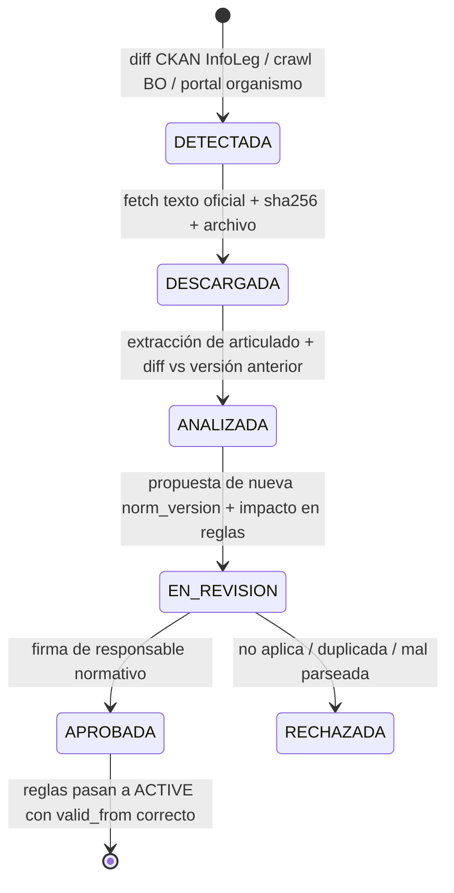

# NORMATIVE_ENGINE.md

> El módulo del que depende la credibilidad de todo el producto. Es **independiente del motor de
> IA** (§5) y no tiene ninguna dependencia hacia `ai-engine`.

## 1. La pregunta que responde

> *Dado un hecho ocurrido el `D`, para un ente de tipo `T`, en jurisdicción `J`, bajo organismo de
> control `O`, con marco `F` — ¿qué reglas eran aplicables y de qué texto exacto surgen?*

Y las dos respuestas que también son válidas:

- `FUENTE NO ENCONTRADA` — no hay norma relevada para el caso.
- `CONFLICTO NORMATIVO — REQUIERE REVISIÓN` — hay más de una regla aplicable de igual prioridad.

El motor **no desempata, no interpola y no infiere**. Prefiere devolver un no-resultado antes que
un resultado inventado. Esto es el §30 y el §52 traducidos a código.

---

## 2. Por qué la vigencia no es un `WHERE fecha <= now()`

El caso está **verificado empíricamente** en `OFFICIAL_SOURCES.md` §3:

| Fuente | Vigencia de la RT 54 |
|--------|----------------------|
| FACPCE | Ejercicios iniciados desde **01/07/2024** |
| CPCECABA (Res. **P.** N° 460/2024, 11/07/2024) | Ejercicios iniciados desde **01/01/2025** |

Una sociedad inscripta en CABA con cierre 30/11 no aplica RT 54 por primera vez en el mismo
ejercicio que un ente de otra jurisdicción. Además:

- La vigencia se ata al **inicio del ejercicio**, no al hecho ni al cierre.
- La Res. JG 660/2026 introduce una **dispensa transitoria** de presentación que no posterga la
  vigencia: un estado que puede ser distinto de "aplica" y de "no aplica".

Por eso la resolución es una función de cinco variables, no de una:

```ts
applicability(norm, { factDate, periodStartDate, jurisdiction, entityType, framework })
```

**Antipatrón prohibido en este repositorio:** `SELECT * FROM norms WHERE fecha_vigencia <= CURRENT_DATE
AND (fecha_derogacion IS NULL OR fecha_derogacion > CURRENT_DATE)`. Recontabilizar 2024 con el
derecho de 2026 es exactamente el error que el §6 pide evitar.

---

## 3. Modelo temporal — tiempo doble

Cada norma tiene dos ejes de tiempo, como corresponde a un registro auditable:

| Eje | Significado | Uso |
|-----|-------------|-----|
| **Tiempo de vigencia** (`valid_from` / `valid_to`) | Cuándo la norma rige en el mundo | Resolver qué se aplicaba al hecho |
| **Tiempo de sistema** (`recorded_from` / `recorded_to`) | Cuándo el sistema supo de ella | Reproducir la decisión de ayer con el conocimiento de ayer |

Sin el segundo eje no se puede responder *"¿por qué el sistema clasificó así en marzo, si hoy la
regla dice otra cosa?"*. Con ambos, la respuesta es exacta: *"en marzo el sistema conocía la
versión N de la norma; en abril se incorporó la versión N+1 aprobada por Fulano"*.

---

## 4. Algoritmo de resolución

```
1.  Normalizar contexto (fecha del hecho, inicio del período, jurisdicción, tipo de ente, marco).
2.  Candidatas = normas cuyo ámbito de aplicación intersecta el contexto.
3.  Filtro de vigencia = por norma, resolver la version aplicable según el eje de vigencia
      Y la adopción jurisdiccional (norm_adoptions) cuando el organismo emisor es profesional.
4.  Filtro de conocimiento = descartar versiones con recorded_from > asOf.
5.  Aplicar jerarquía P1 > P2 > P3 > P4; dentro del mismo nivel, lex specialis y lex posterior
      SOLO si están declaradas explícitamente en norm_modifications. Nunca por heurística.
6.  Si quedan >1 reglas de igual prioridad sin relación de derogación declarada:
      → emitir CONFLICTO NORMATIVO y NO resolver.
7.  Si quedan 0:
      → emitir FUENTE NO ENCONTRADA.
8.  Devolver reglas + citas + huecos detectados.
```

Los pasos 5–7 son el corazón: la única forma de que el motor elija entre dos normas es que exista
una relación de derogación o sustitución **cargada desde el texto oficial**. Ninguna decisión sale
del criterio del modelo de lenguaje.

---

## 5. Anatomía de una regla

```jsonc
{
  "rule_id": "AR-IVA-CF-COMPUTABLE-001",
  "norm_version_id": "…",          // obligatorio, NOT NULL
  "version": 3,
  "domain": "tax",
  "valid_from": "2024-07-01",
  "valid_to": null,
  "jurisdiction": "AR",
  "entity_type": ["SA", "SRL", "SAS"],
  "framework": ["RT_FACPCE"],
  "priority": 100,
  "conditions": { /* AST evaluable, sin código arbitrario */ },
  "action":     { /* efecto declarativo */ },
  "citation": {
    "organismo": "ARCA", "norma": "RG …", "articulo": "…",
    "version": 3, "vigencia_desde": "2024-07-01",
    "url_oficial": "https://…", "documento_sha256": "…"
  },
  "status": "ACTIVE",
  "approved_by": "user:…", "approved_at": "…"
}
```

Restricciones estructurales:

- `norm_version_id` es `NOT NULL`. **No existe regla sin norma.**
- `conditions` y `action` son **datos declarativos evaluados por un intérprete cerrado**, no
  JavaScript. Una regla no puede ejecutar código arbitrario ni hacer red.
- `status = ACTIVE` requiere `approved_by`. Nadie activa una regla sin firma.
- La cita incluye el `sha256` del documento archivado: la trazabilidad llega al **byte**, no a la URL
  (las URLs oficiales cambian; los hashes no).

---

## 6. Sistema de citas (§31)

Toda salida del motor es citable. Formato de render en UI:

```
Regla aplicada:   Cómputo del crédito fiscal — AR-IVA-CF-COMPUTABLE-001 v3
Fuente:           ARCA
Norma:            Resolución General N° …
Artículo:         …
Versión:          3
Vigente desde:    01/07/2024
Adoptada en:      —
URL oficial:      https://…
Documento:        rg_xxxx.pdf · sha256 a1b2c3…
Nivel:            V1 — VERIFICADO OFICIAL
```

Si el nivel es `V2`/`V3`/`V4`, la UI **no muestra la regla como aplicada**: muestra
`FUENTE NO ENCONTRADA` y deriva a revisión profesional. Una cita que no se puede abrir no es una cita.

---

## 7. `Normative Update Service` (§32)



**Nada se activa solo.** Detectar, descargar y analizar es automático; **activar es humano**. El
servicio además emite la alerta "cambio de normativa" del §22 y calcula el **impacto retroactivo**:
qué asientos ya registrados fueron generados con una regla que la nueva norma modifica.

Fuentes y su capacidad real de acceso programático: ver `OFFICIAL_SOURCES.md` §7. Resumen: el
único acceso programático oficial relevado es la **API CKAN de datos.gob.ar** sobre el dataset de
InfoLeg; el Boletín Oficial **no publica API documentada** y se accede por fetch HTML archivado.

---

## 8. Huecos conocidos que el motor debe declarar

El motor arranca con estos `gaps` cargados explícitamente, para que ninguna funcionalidad
dependiente finja estar respaldada.

**Cerrados con la descarga del 2026-08-24:**

| Gap | Cómo se cerró |
|-----|---------------|
| ~~Alcance derogatorio RT 54 (C-03)~~ | Art. 3° del texto oficial: lista expresa de derogaciones. No deroga RT 16 ni RT 26 |
| ~~Fechas de la RG 5616/2024 (C-01)~~ | Art. 5°: WebService obligatorio desde 15/04/2025. El hito 09/2026 era de la RG 5866/2026 |
| ~~RG 5707/2025 y RG 4597 T.O.~~ | Ambas archivadas. Libro de IVA Digital desbloqueado |

**Abiertos:**

| Gap | Bloquea |
|-----|---------|
| Actos de adopción de consejos distintos de CABA | Empresas de otras jurisdicciones. El motor **rechaza resolver** sin la adopción cargada |
| Régimen de ajuste por inflación (contable y fiscal) | Reexpresión en moneda homogénea |
| Percepciones, retenciones e IIBB por régimen y jurisdicción | Módulos fiscales correspondientes |
| Vigencia del t.o. 1997 de IVA (`vigencia_to_1997_iva`) | **La activación de `AR-IVA-CF-VINCULACION-001`.** Falta el texto completo del Decreto 280/1997, que trae la cláusula de vigencia; lo archivado es la ficha de INFOLEG, sin articulado |

Un gap abierto no rompe el sistema: **degrada la funcionalidad a "requiere revisión profesional"**,
que es el comportamiento correcto según el §52.

### Un gap que bloquea, bloquea en la base

La `0033` dice que registra el gap en la base «porque el motor consulta esta
tabla». **No la consultaba**: la única lectura de `normative_gaps` estaba en una
pantalla del estudio, y la regla se podía activar con el gap abierto.

Desde la `0041` el vínculo es estructural —`normative_gaps.blocks_rule_key`, una
columna, no una búsqueda del `rule_key` dentro del texto en prosa de `blocks`— y
lo impone un trigger sobre `accounting_rules`. Ni la API, ni el script, ni un
`UPDATE` a mano pueden llevar a `ACTIVE` una regla que un gap abierto nombre.

`npm run reglas:aprobar` además lo consulta **antes** de intentar nada, para
poder decir cuál es el gap y qué documento falta, en vez de devolver un error de
constraint.

Cerrar un gap es incorporar la fuente oficial que falta —descarga, SHA-256,
registro en `registro-de-descargas.csv`—, no cambiarle el estado.

## 9. Lección de campo: la vigencia se mueve incluso dentro de una misma norma

La RT 54 tuvo tres fechas de vigencia sucesivas, todas verificables en fuente oficial:

| Fecha | Origen |
|-------|--------|
| Ejercicios iniciados desde **01/01/2024** | Art. 2° del texto original de la RT 54 (01/07/2022) |
| Ejercicios iniciados desde **01/07/2024** | Tras la RT 56 (30/06/2023) |
| Ejercicios iniciados desde **01/01/2025** | Adopción del CPCECABA (Res. P. N° 460/2024, art. 5°), con anticipada para ejercicios *finalizados* desde 30/09/2024 |

Tres valores para "la vigencia de la RT 54", y el correcto depende de a quién se le pregunte y
dónde esté inscripta la empresa. Nótese además que el tercero se ancla en el **cierre** y no en el
inicio para la aplicación anticipada. Un `fecha_vigencia` escalar no puede representar esto; por eso
el modelo es `norm_versions` + `norm_adoptions` + eje bitemporal.

Un gap abierto no rompe el sistema: **degrada la funcionalidad a "requiere revisión profesional"**,
que es el comportamiento correcto según el §52.
