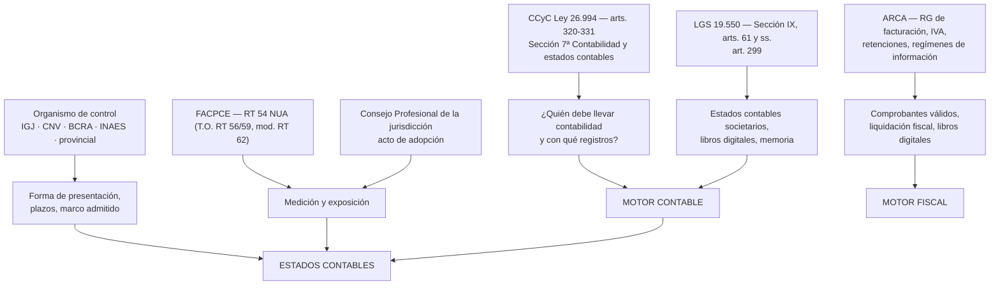

# Mapa Normativo

> Entregable E del §51. Qué norma gobierna qué capacidad del sistema, y de qué depende su
> aplicabilidad. Los niveles de verificación están en `OFFICIAL_SOURCES.md`.

## 1. Capas normativas

**El punto no obvio:** `G` no llega solo a `H`. Necesita pasar por `I`. Una RT sin adopción del
consejo de la jurisdicción no es obligatoria allí. Esa arista es la razón de la tabla
`norm_adoptions`.

---

## 2. Qué determina la aplicabilidad

Ninguna regla del sistema depende de una sola variable. El vector completo:

| Variable | Origen | Ejemplo de efecto |
|----------|--------|-------------------|
| **Fecha del hecho** | Comprobante | Alícuota y régimen vigentes entonces |
| **Fecha de inicio del ejercicio** | `fiscal_years` | Vigencia de la RT 54 se ata al inicio, no al hecho |
| **Jurisdicción** | `companies.jurisdiction` | RT 54: 01/07/2024 (FACPCE) vs 01/01/2025 (CABA) |
| **Tipo de ente** | `companies.entity_type` | SA art. 299 vs SRL vs asociación civil vs cooperativa |
| **Organismo de control** | `companies.regulator` | IGJ, CNV, BCRA, INAES imponen marcos distintos |
| **Opción normativa ejercida** | `company_reporting_frameworks` | RG IGJ 9/2026 admite RT FACPCE, NIIF o NIIF PyMES |
| **Tamaño / ingresos** | Parámetro actualizable | Categoría de ente en la RT 54 |
| **Actividad** | `companies.activity_code` | Regímenes sectoriales, exenciones |
| **Régimen fiscal** | Padrón ARCA | RI, exento, monotributo |

Una regla que no declare de cuáles de estas depende, no puede activarse.

---

## 3. Mapa por capacidad del sistema

Estado al 2026-08-26, tras la descarga y archivado de 25 documentos oficiales.

| Capacidad | Normas de referencia | Depende de | Estado |
|-----------|---------------------|------------|--------|
| Obligación de llevar contabilidad y registros indispensables | CCyC arts. 320-331 | Tipo de sujeto | ✅ `V1` |
| Libros por medios digitales | LGS art. 61; RG IGJ | Jurisdicción, organismo | ✅ `V1` |
| Contenido de estados contables societarios | LGS arts. 62-66 | Tipo societario | ✅ `V1` |
| Presentación ante IGJ (plazos, forma) | RG IGJ 15/2024 mod. por RG 9/2026 | IGJ + tipo de ente + art. 299 | ✅ `V1` (ambas) |
| Marco contable admitido por IGJ | RG IGJ 9/2026, arts. 226 y 230 sustituidos | **Adopción del CPCECABA** + opción del ente | ✅ `V1` |
| Medición y exposición | RT 54 (T.O. RT 56 y RT 59, mod. RT 62) | **Adopción del consejo** + inicio de ejercicio | ✅ `V1` (cadena completa) |
| Alcance derogatorio de la NUA | RT 54 art. 3° | — | ✅ `V1` — resuelto |
| Primera aplicación de la NUA | Res. JG FACPCE 660/2026 + Apéndice A | Ente en transición | ✅ `V1` |
| Transición desde NIIF a la NUA | RT 59 art. 4° (sustituye punto 7 de RT 26) | Ente que abandona NIIF | ✅ `V1` |
| Categoría de ente por ingresos | Tabla de montos FACPCE (act. 2025-11) | Ingresos del ejercicio | ✅ `V1` — parámetro versionado |
| Comprobantes válidos y CAE | RG 1415 (arts. 15 a 17); RG 3561; RG 4291; RG 5198; RG 5616/2024; RG 5866/2026 | Tipo de comprobante, condición del receptor, fecha | ✅ `V1` — completo: los T.O. de 3561 y 5198 se archivaron el 2026-08-27 |
| Condición IVA del receptor | RG 5616/2024 art. 5° | Fecha (WS obligatorio 15/04/2025) | ✅ `V1` — conflicto cerrado |
| Cronograma de nuevos obligados | RG 5866/2026 | Actividad, fecha (hasta 01/03/2027) | ✅ `V1` |
| Constatación de comprobantes recibidos | `wscdcv1` | Habilitación del CUIT | ✅ `V1` |
| Libro de IVA Digital | RG 4597 (T.O.); RG 5707/2025 | Sujeto obligado, período | ✅ `V1` — **FASE 8 desbloqueada** |
| Adopción jurisdiccional fuera de CABA | Resoluciones de cada consejo | Jurisdicción | 🟡 `V2` — el motor rechaza resolver |
| Percepciones y retenciones | RG por régimen | Régimen, jurisdicción | ⬜ No relevado |
| Ingresos Brutos | Normativa provincial y CM | Jurisdicción(es) | ⬜ No relevado |
| Ajuste por inflación | No relevado | Índices y condiciones | ⬜ **Gap declarado** |

"No relevado" y "Gap declarado" son estados legítimos y visibles en la UI. Lo ilegítimo sería que
el sistema operara igual y no lo dijera.

---

## 4. Normas que dependen de la jurisdicción

- **Adopción de RTs**: cada Consejo Profesional. Verificado que CABA difiere de FACPCE.
- **Organismo de registro societario**: IGJ en CABA; direcciones provinciales de personas
  jurídicas en el interior, con normativa propia.
- **Ingresos Brutos**: 24 jurisdicciones + Convenio Multilateral.
- **Sellos**: provincial.
- **Formalidades de rúbrica y libros digitales**: por organismo de registro.

Consecuencia de diseño: `jurisdiction` es un campo de primera clase, presente en `companies`,
`norms`, `norm_adoptions`, `accounting_rules`, `tax_rules` y en la firma de `resolveRules()`.

## 5. Normas que dependen del tipo de entidad

| Tipo | Particularidad |
|------|----------------|
| SA comprendida en art. 299 LGS | Fiscalización estatal permanente; plazos y requisitos más exigentes |
| SA/SRL no comprendida | Régimen general |
| SAS (Ley 27.349) | Registros digitales; régimen propio |
| Asociación civil / fundación | Categorías I, II, III en IGJ; estados y requisitos distintos |
| Cooperativa | INAES; **Cap. 12 de la RT 54 incorporado por RT 62** |
| Entidad financiera | BCRA; marco contable propio |
| Emisora con oferta pública | CNV; NIIF |
| Sucursal de sociedad extranjera | Régimen propio en IGJ |

## 6. Contradicciones registradas

Ver `OFFICIAL_SOURCES.md` §6 — C-01 a C-05. Se repiten aquí las dos con impacto estructural:

- **C-02** (vigencias RT 54 distintas por jurisdicción): no es contradicción a resolver, es
  realidad a modelar.
- **C-04** (IGJ admite tres marcos alternativos): la opción es del ente y **debe registrarse con
  respaldo documental**; el sistema no la adivina.
